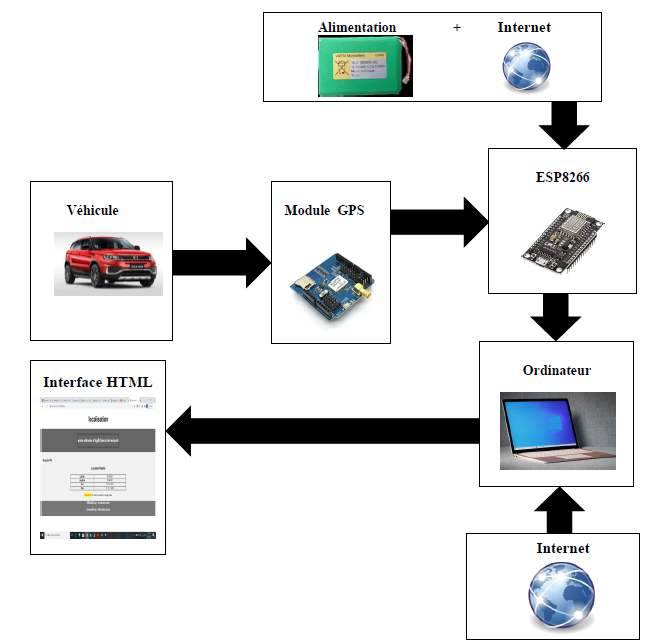
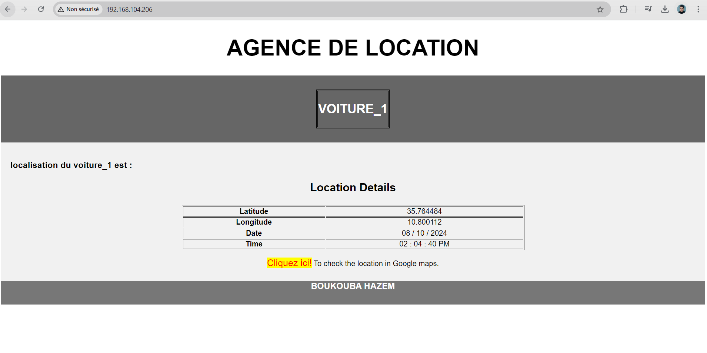

# Système de Suivi GPS pour Véhicules 🚗📡

Ce projet est une solution de suivi en temps réel pour les véhicules, conçue à l'aide d'un **module GPS**, d'un **ESP8266**, et d'une plateforme en ligne pour la visualisation des données.

## 📋 Fonctionnalités
- 📍 **Localisation GPS** : Capture des coordonnées géographiques en temps réel.
- 🌐 **Connectivité Wi-Fi** : Transfert des données via l'ESP8266.
- 💻 **Interface Web** : Visualisation des positions sur une carte interactive.
- 🔧 **Simplicité** : Facile à configurer et personnaliser.

## 🛠️ Matériel Utilisé
- **Module GPS** : Fournit les données de localisation.
- **ESP8266** : Permet la connectivité réseau.
- **Alimentation électrique** : Batterie ou adaptateur secteur.

## 💻 Logiciels Utilisés
- **Arduino IDE** : Programmation du microcontrôleur.
- **Plateforme en ligne** : Affichage des données (par exemple, Google Maps ).

## 🚀 Comment Démarrer
1. Téléchargez ou clonez ce dépôt :
   ```bash
   git clone https://github.com/hazemboukouba/tracking_system_project_esp8266_GPS.git
2. Configurez le fichier de code pour inclure vos informations Wi-Fi
3. Téléversez le code dans l'ESP8266 via l'Arduino IDE.
4. Lancez le système et commencez à suivre votre véhicule en temps réel !

## schéma synoptique

Voici un schéma synoptique du projet :



## 📸 Aperçu

Voici un aperçu de notre système en action :



## 📧 Contact
Hazem BOUKOUBA - Ingénieur en systèmes embarqués passionné.
Pour toute question ou suggestion, contactez-moi à www.linkedin.com/in/boukouba-hazem


 
